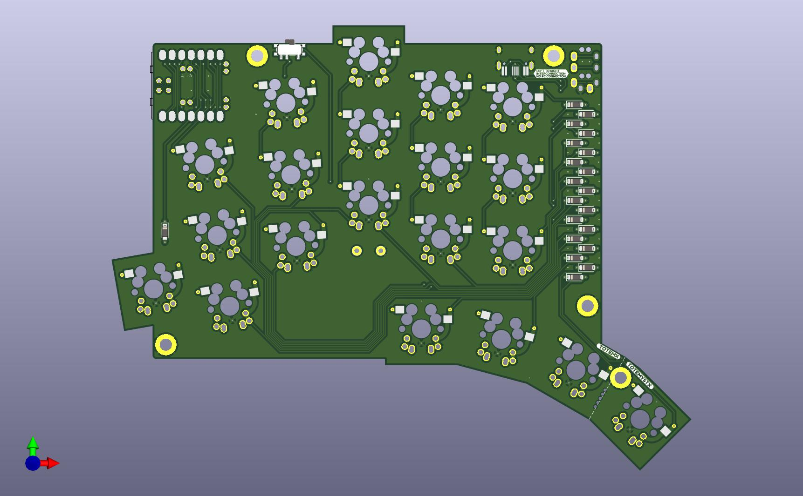
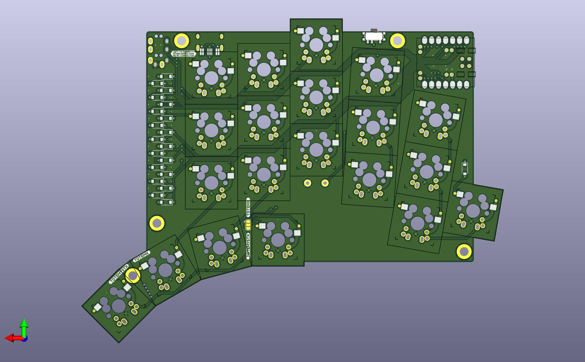
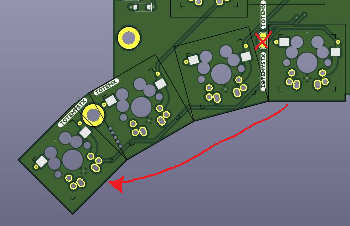
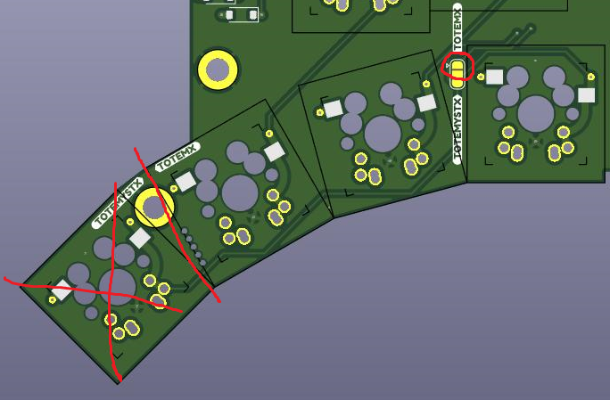
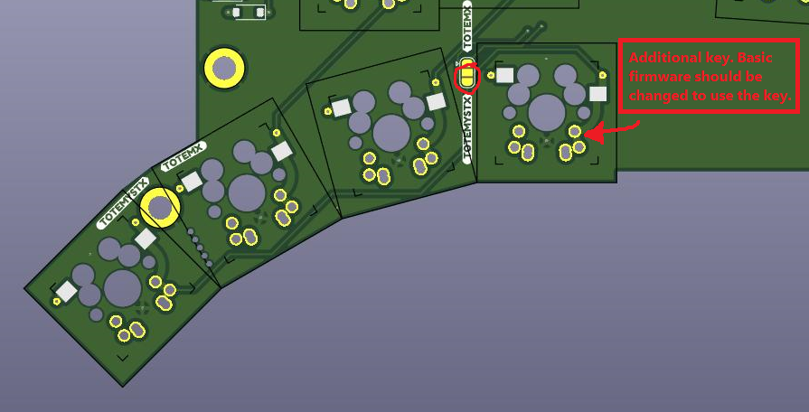
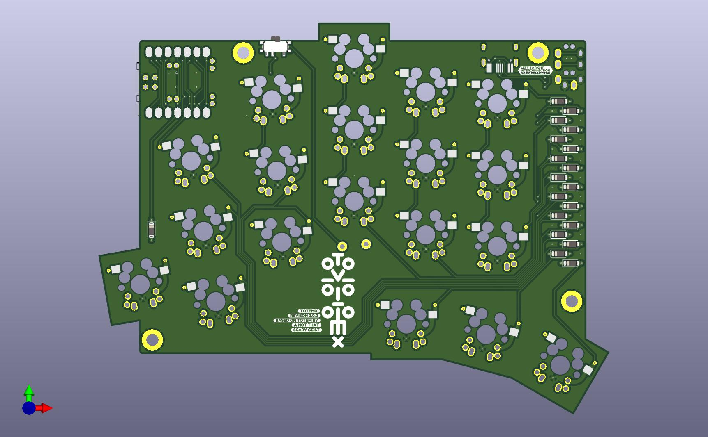
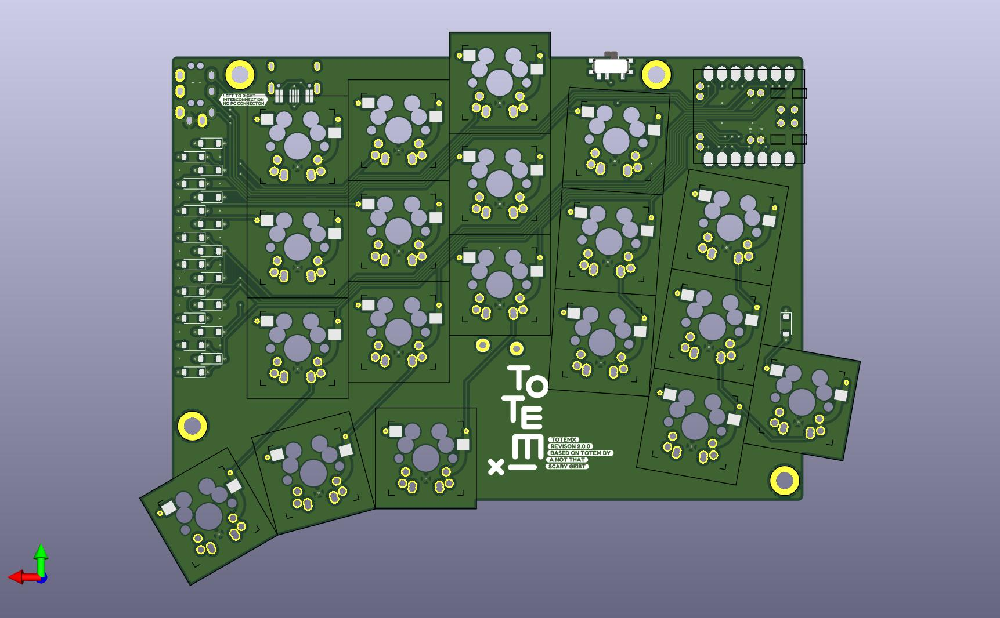

# TOTEMYSTX
TOTEMYSTX is a 38-40 keys column-staggered split keyboard. It meant to be used with a Seed Studio XIAO RP2040 or nRF52840.
TOTEMYSTX is a replica of the famous TOTEM by GEIGEIGEIST for MX spacing (19.05x19.05mm) switches like Cherry MX.

**Warning. I don't have printed PCBs on hands, so can't check or debug. It should work in theory. Use this files on youre own risk.**

https://github.com/GEIGEIGEIST/TOTEM

TOTEMYSTX with 38 keys shares the same firmware as of the original TOTEM.

There are 3 mods for the TOTEMYSTX use cases.

The jumper is open. 38 keys as usual, but the right thumb key not in use, has no connection to the MCU.

If you'll cut out the outer thumb key, you have to solder the jumper in "TOTEMX" mode. It's will be classical TOTEM/TOTEMX.

To use all 40 keys, you have to solder the jumper in "TOTEMYSTX" mode and change a keymap and recompile then.

TOTEMX with 38 keys shares the same firmware as of the original TOTEM.

Cases's models are designed to use M2 screws. For the TOTEMYSTX case use M2\*10mm -8pcs and M2\*8mm -2pcs and M2\*10mm -8pcs for the TOTEMX case.

The cases and PCBs are not compatible with the previous version. https://github.com/azhizhinov/TOTEMX
